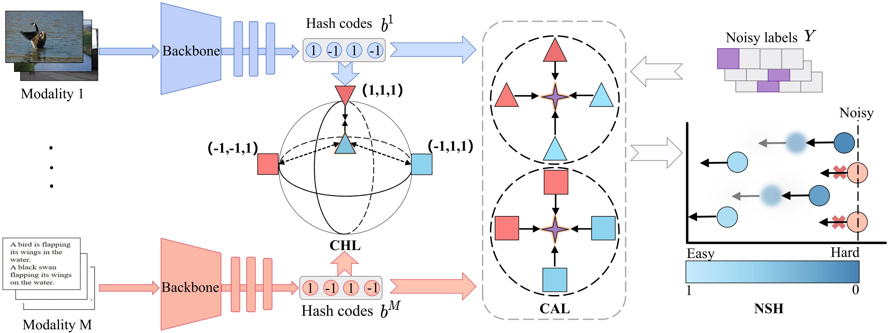

# RSHNL
The code for Robust Self-paced Hashing for Cross-Modal Retrieval with Noisy Labels (AAAI'25).

# Datasets
We use the XMedia dataset as an example, and the data is placed in 'datasets/...'. The other datasets will be released soon.

# Framework

# Results


# Citation
If you find this code useful for your research, please cite our paper:

```bib
@article{pu2025robust,  
  title={Robust Self-Paced Hashing for Cross-Modal Retrieval with Noisy Labels},  
  volume={39},  
  number={19},  
  journal={Proceedings of the AAAI Conference on Artificial Intelligence},  
  author={Pu, Ruitao and Sun, Yuan and Qin, Yang and Ren, Zhenwen and Song, Xiaomin and Zheng, Huiming and Peng, Dezhong},  
  year={2025},  
  pages={19969--19977}  
}